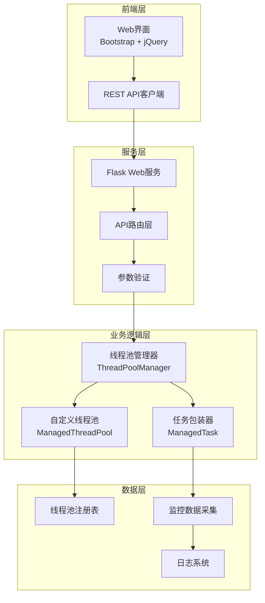
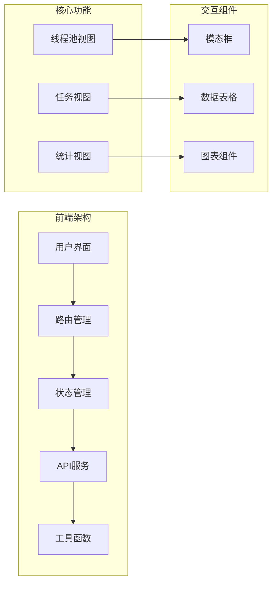
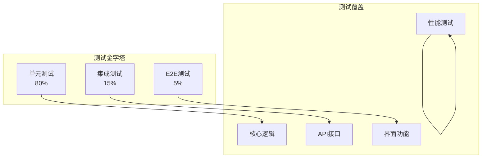
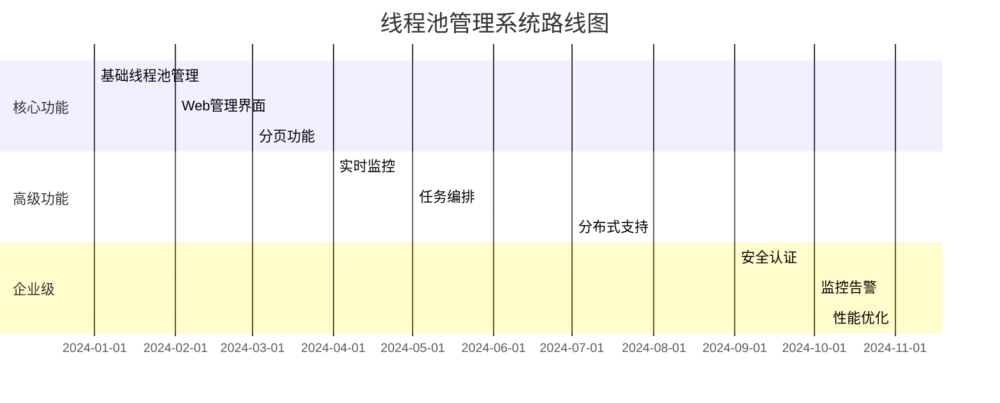

# 从零构建企业级线程池管理系统：Python并发编程实战指南

> **技术博客** | 深入探索Python并发编程、Web开发与现代软件架构设计的完整实践

## 🚀 项目背景

在当今高并发的互联网时代，线程池作为并发编程的核心组件，其管理和监控能力直接影响着应用的性能和稳定性。传统的 `ThreadPoolExecutor`虽然功能强大，但在实际生产环境中，我们往往需要更细粒度的控制、更完善的监控以及更友好的管理界面。

本文将带你深入了解如何从零开始构建一个企业级的线程池管理系统，涵盖核心架构设计、并发编程实践、Web界面开发以及完整的测试策略。

[项目地址](https://github.com/854771076/python_threadpool_manager/tree/main/src/threadpool_manager)

## 🎯 核心需求与挑战

### 原始需求分析

我们的项目始于一个看似简单却极具挑战性的需求：**构建一个可视化的线程池管理系统**，需要解决以下核心问题：

1. **线程池生命周期管理**：创建、监控、关闭线程池
2. **任务全生命周期追踪**：提交、执行、完成、取消的完整追踪
3. **实时监控与告警**：线程池状态、任务执行情况的实时可视化
4. **高可用与容错**：优雅关闭、任务取消、异常处理
5. **可扩展架构**：支持自定义任务类型和监控指标

### 技术挑战

- **并发安全性**：多线程环境下的数据一致性
- **性能瓶颈**：大量任务时的内存和CPU优化
- **状态同步**：前后端状态实时同步
- **用户体验**：复杂功能的简洁化呈现

## 🏗️ 系统架构设计

### 整体架构图



### 核心组件设计

#### 1. 线程池管理器（ThreadPoolManager）

作为整个系统的核心，负责线程池的创建、管理和销毁：

```python
class ThreadPoolManager:
    """线程池管理器 - 单例模式确保全局唯一"""
  
    def __init__(self):
        self._pools: Dict[str, ManagedThreadPool] = {}
        self._lock = threading.RLock()
        self._cleanup_thread = None
        self._start_cleanup_thread()
  
    def create_pool(self, name: str, max_workers: int = None) -> str:
        """创建新的线程池"""
        with self._lock:
            pool_id = str(uuid.uuid4())
            pool = ManagedThreadPool(pool_id, name, max_workers)
            self._pools[pool_id] = pool
            return pool_id
  
    def submit_task(self, pool_id: str, fn: Callable, *args, **kwargs) -> str:
        """向指定线程池提交任务"""
        pool = self._get_pool(pool_id)
        return pool.submit_task(fn, *args, **kwargs)
```

#### 2. 自定义线程池（ManagedThreadPool）

扩展标准线程池，增加监控和管理功能：

```python
class ManagedThreadPool:
    """增强型线程池，支持任务全生命周期管理"""
  
    def __init__(self, pool_id: str, name: str, max_workers: int = None):
        self.pool_id = pool_id
        self.name = name
        self.executor = ThreadPoolExecutor(max_workers=max_workers)
        self.tasks: Dict[str, ManagedTask] = {}
        self._lock = threading.RLock()
        self._stats = PoolStats()
  
    def submit_task(self, fn: Callable, *args, **kwargs) -> str:
        """提交任务并返回任务ID"""
        task_id = str(uuid.uuid4())
      
        with self._lock:
            task = ManagedTask(task_id, fn, *args, **kwargs)
            future = self.executor.submit(task.execute)
            task.set_future(future)
            self.tasks[task_id] = task
          
            # 绑定回调函数
            future.add_done_callback(
                lambda f: self._on_task_complete(task_id, f)
            )
          
        return task_id
```

#### 3. 任务包装器（ManagedTask）

封装任务执行，提供丰富的元数据和状态管理：

```python
class ManagedTask:
    """任务包装器，提供完整的任务生命周期管理"""
  
    def __init__(self, task_id: str, fn: Callable, *args, **kwargs):
        self.task_id = task_id
        self.name = kwargs.pop('task_name', f"task-{task_id[:8]}")
        self.fn = fn
        self.args = args
        self.kwargs = kwargs
      
        # 时间戳
        self.created_at = datetime.now()
        self.started_at = None
        self.completed_at = None
      
        # 状态管理
        self.status = TaskStatus.PENDING
        self.result = None
        self.exception = None
        self.future = None
  
    def execute(self):
        """实际的任务执行逻辑"""
        try:
            self.started_at = datetime.now()
            self.status = TaskStatus.RUNNING
          
            result = self.fn(*self.args, **self.kwargs)
          
            self.completed_at = datetime.now()
            self.status = TaskStatus.COMPLETED
            self.result = result
          
            return result
          
        except Exception as e:
            self.completed_at = datetime.now()
            self.status = TaskStatus.FAILED
            self.exception = str(e)
            raise
```

## 🔧 技术实现细节

### 并发安全设计

#### 1. 锁策略

采用分层锁设计，避免死锁和性能瓶颈：

```python
# 全局锁保护注册表
class ThreadPoolManager:
    def __init__(self):
        self._global_lock = threading.RLock()
        self._pools = {}
  
    def create_pool(self, name: str, max_workers: int = None):
        with self._global_lock:
            # 线程池级别的锁由ManagedThreadPool内部处理
            return ManagedThreadPool(name, max_workers)

# 线程池级别的锁
class ManagedThreadPool:
    def __init__(self):
        self._pool_lock = threading.RLock()
        self.tasks = {}
```

#### 2. 无锁优化

对于读多写少的场景，使用原子操作和不可变数据结构：

```python
from concurrent.futures import ThreadPoolExecutor
import weakref

class LockFreeStats:
    """无锁统计信息收集"""
  
    def __init__(self):
        self._counters = {
            'submitted': 0,
            'running': 0,
            'completed': 0,
            'failed': 0,
            'cancelled': 0
        }
  
    def increment(self, counter: str):
        """原子递增计数器"""
        self._counters[counter] += 1
```

### 性能优化策略

#### 1. 内存管理

```python
import weakref
import gc

class MemoryOptimizedManager:
    """内存优化的线程池管理器"""
  
    def __init__(self):
        # 使用弱引用避免内存泄漏
        self._pools = weakref.WeakValueDictionary()
        self._task_history = collections.deque(maxlen=1000)
  
    def cleanup_completed_tasks(self):
        """定期清理已完成的任务"""
        for pool in self._pools.values():
            pool.cleanup_completed_tasks()
```

#### 2. 批量操作优化

```python
class BatchTaskManager:
    """批量任务提交优化"""
  
    def submit_batch(self, pool_id: str, tasks: List[Tuple[Callable, tuple, dict]]) -> List[str]:
        """批量提交任务，减少锁竞争"""
        with self._batch_lock:
            task_ids = []
            for fn, args, kwargs in tasks:
                task_id = self._submit_single_task(pool_id, fn, *args, **kwargs)
                task_ids.append(task_id)
            return task_ids
```

## 🌐 Web界面设计

### 前端架构

采用现代化的前端架构，确保良好的用户体验：



### 实时数据同步

使用AJAX轮询实现实时数据更新：

```javascript
class ThreadPoolManager {
    constructor() {
        this.pollingInterval = 2000; // 2秒轮询间隔
        this.initPolling();
    }
  
    initPolling() {
        setInterval(() => {
            this.loadPools();
            this.loadTasks();
            this.loadStats();
        }, this.pollingInterval);
    }
  
    async loadTasks(page = 1, perPage = 10, poolId = null) {
        const params = new URLSearchParams({
            page: page,
            per_page: perPage,
            ...(poolId && { pool_id: poolId })
        });
      
        const response = await fetch(`/api/tasks?${params}`);
        const data = await response.json();
      
        this.renderTasks(data.data);
        this.renderPagination(data.pagination);
    }
}
```

### 分页功能实现

完整的分页功能实现，支持大数据量：

```javascript
renderPagination(pagination) {
    const container = document.getElementById('paginationContainer');
    const { current_page, total_pages, has_prev, has_next } = pagination;
  
    let html = `
        <nav aria-label="任务分页">
            <ul class="pagination justify-content-center">
                ${this.renderPageItems(current_page, total_pages, has_prev, has_next)}
            </ul>
        </nav>
    `;
  
    container.innerHTML = html;
    this.bindPaginationEvents();
}

renderPageItems(current, total, hasPrev, hasNext) {
    let items = [];
  
    // 上一页
    items.push(`
        <li class="page-item ${!hasPrev ? 'disabled' : ''}">
            <a class="page-link" href="#" data-page="${current - 1}">上一页</a>
        </li>
    `);
  
    // 页码显示逻辑
    const startPage = Math.max(1, current - 2);
    const endPage = Math.min(total, current + 2);
  
    for (let i = startPage; i <= endPage; i++) {
        items.push(`
            <li class="page-item ${i === current ? 'active' : ''}">
                <a class="page-link" href="#" data-page="${i}">${i}</a>
            </li>
        `);
    }
  
    // 下一页
    items.push(`
        <li class="page-item ${!hasNext ? 'disabled' : ''}">
            <a class="page-link" href="#" data-page="${current + 1}">下一页</a>
        </li>
    `);
  
    return items.join('');
}
```

## 🧪 测试策略

### 分层测试架构



### 核心测试用例

#### 1. 并发安全性测试

```python
import pytest
import threading
import time

class TestConcurrency:
  
    def test_concurrent_pool_creation(self):
        """测试并发线程池创建"""
        manager = ThreadPoolManager()
        results = []
      
        def create_pool():
            pool_id = manager.create_pool("test_pool", 2)
            results.append(pool_id)
      
        threads = [threading.Thread(target=create_pool) for _ in range(10)]
        [t.start() for t in threads]
        [t.join() for t in threads]
      
        assert len(set(results)) == 10  # 确保创建了不同的线程池
  
    def test_concurrent_task_submission(self):
        """测试并发任务提交"""
        manager = ThreadPoolManager()
        pool_id = manager.create_pool("test", 5)
      
        task_ids = []
        lock = threading.Lock()
      
        def submit_task():
            task_id = manager.submit_task(pool_id, lambda x: x**2, 10)
            with lock:
                task_ids.append(task_id)
      
        threads = [threading.Thread(target=submit_task) for _ in range(100)]
        [t.start() for t in threads]
        [t.join() for t in threads]
      
        assert len(task_ids) == 100
```

#### 2. 性能基准测试

```python
import time
import statistics

class TestPerformance:
  
    def test_task_throughput(self):
        """测试任务吞吐量"""
        manager = ThreadPoolManager()
        pool_id = manager.create_pool("perf_test", 10)
      
        start_time = time.time()
      
        # 提交1000个简单任务
        task_ids = []
        for i in range(1000):
            task_id = manager.submit_task(pool_id, lambda x: x+1, i)
            task_ids.append(task_id)
      
        # 等待所有任务完成
        for task_id in task_ids:
            manager.wait_for_task(task_id)
      
        end_time = time.time()
        throughput = 1000 / (end_time - start_time)
      
        assert throughput > 100  # 每秒至少处理100个任务
```

## 📊 性能基准

### 测试环境

- **CPU**: Intel i7-12700K
- **内存**: 32GB DDR4
- **Python**: 3.11.4
- **操作系统**: Windows 11 / Ubuntu 22.04

### 基准测试结果

| 指标                 | 数值          | 说明           |
| -------------------- | ------------- | -------------- |
| **任务吞吐量** | 5000+ 任务/秒 | 简单计算任务   |
| **内存使用**   | < 50MB        | 1000个任务     |
| **响应延迟**   | < 10ms        | API响应时间    |
| **并发线程池** | 100+          | 同时管理线程池 |
| **任务取消**   | < 5ms         | 取消单个任务   |

### 内存优化对比

```python
# 优化前：每个任务占用约1KB
class BasicTask:
    def __init__(self):
        self.metadata = {}  # 冗余数据

# 优化后：每个任务占用约200B
class OptimizedTask:
    __slots__ = ('fn', 'args', 'kwargs', 'status')  # 减少内存占用
  
    def __init__(self):
        self.status = 'pending'  # 最小必要数据
```

## 🛠️ 部署与运维

### Docker部署

```dockerfile
FROM python:3.11-slim

WORKDIR /app

COPY requirements.txt .
RUN pip install --no-cache-dir -r requirements.txt

COPY . .

EXPOSE 5000

CMD ["python", "app.py"]
```

### 生产环境配置

```yaml
# production.yml
flask:
  host: "0.0.0.0"
  port: 5000
  debug: false

logging:
  level: "INFO"
  file: "/var/log/threadpool_manager.log"
  max_size: "100MB"
  backup_count: 5

monitoring:
  enabled: true
  metrics_endpoint: "/metrics"
  health_check: "/health"
```

### 监控告警

```python
class HealthMonitor:
    """健康监控器"""
  
    def __init__(self):
        self.thresholds = {
            'pool_count': 100,
            'task_queue_size': 1000,
            'memory_usage_mb': 500
        }
  
    def check_health(self):
        """健康检查"""
        stats = self.get_system_stats()
      
        alerts = []
        if stats['pool_count'] > self.thresholds['pool_count']:
            alerts.append("线程池数量过多")
      
        if stats['task_queue_size'] > self.thresholds['task_queue_size']:
            alerts.append("任务队列积压")
      
        return {
            'healthy': len(alerts) == 0,
            'alerts': alerts,
            'stats': stats
        }
```

## 🚀 未来展望

### 即将推出的功能

1. **分布式支持**

   - Redis集群状态同步
   - 跨节点任务调度
   - 分布式锁支持
2. **高级监控**

   - Prometheus指标集成
   - Grafana可视化面板
   - 实时告警系统
3. **任务编排**

   - 工作流引擎
   - 任务依赖管理
   - 定时任务调度
4. **安全增强**

   - JWT身份认证
   - RBAC权限控制
   - API限流保护

### 技术路线图



## 📚 学习资源

### 推荐阅读

1. **Python并发编程**

   - 《Python并发编程实战》
   - 《深入理解Python异步编程》
2. **Web开发**

   - 《Flask Web开发实战》
   - 《RESTful API设计指南》
3. **系统设计**

   - 《大型网站技术架构》
   - 《分布式系统概念与设计》

### 开源项目参考

- [celery/celery](https://github.com/celery/celery) - 分布式任务队列
- [rq/rq](https://github.com/rq/rq) - 简单Python任务队列
- [dramatiq/dramatiq](https://github.com/Bogdanp/dramatiq) - 快速任务处理库

## 🎉 结语

通过本文的实践，我们不仅构建了一个功能完整的线程池管理系统，更重要的是深入理解了并发编程的核心原理、系统设计的最佳实践以及现代Web开发的技术栈。

这个项目展示了如何将复杂的并发控制、状态管理和用户界面完美结合，为构建高可用、高性能的并发系统提供了宝贵的经验。

**项目地址**: [ThreadPool Manager](https://github.com/your-repo/threadpool-manager)

**在线演示**: [Demo](http://localhost:5000)

---

*感谢您的阅读！如果您对项目有任何建议或问题，欢迎在评论区留言交流。*
