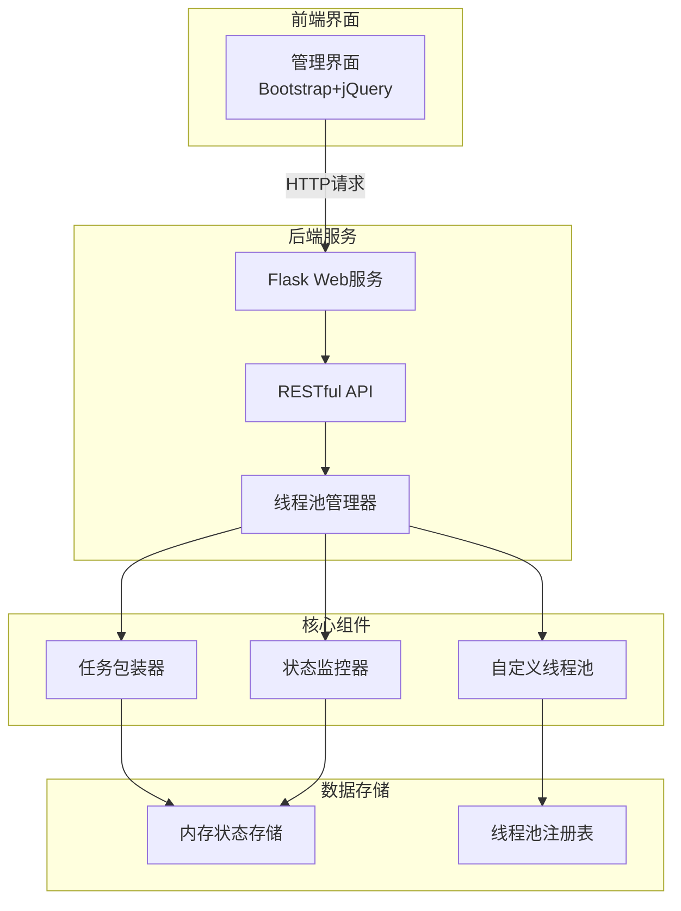

# 线程池管理项目技术架构设计

## 1. 系统架构概览

## 2. 核心组件设计

### 2.1 线程池管理器（ThreadPoolManager）

### 2.2 自定义线程池（ManagedThreadPool）

### 2.3 任务包装器（ManagedTask）

## 3. 状态管理设计

### 3.1 线程池状态

### 3.2 任务状态

## 4. 技术实现要点

### 4.1 线程安全
- 使用线程安全的字典存储线程池和任务
- 使用锁机制保护共享数据
- 使用原子操作更新状态

### 4.2 性能优化
- 使用弱引用避免内存泄漏
- 定期清理已完成的任务
- 使用缓存减少状态查询开销

### 4.3 异常处理
- 任务异常不会导致线程池崩溃
- 提供详细的异常信息和堆栈跟踪
- 支持任务重试机制

## 5. API设计

### 5.1 RESTful端点

## 6. 扩展性设计

### 6.1 插件架构
- 支持自定义线程池实现
- 支持自定义任务包装器
- 支持自定义状态存储后端

### 6.2 配置管理
- 支持运行时配置修改
- 支持配置文件热加载
- 支持环境变量配置