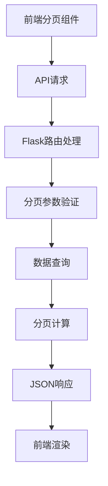

# 分页功能技术架构设计

## 系统架构图



## 数据流设计

### 1. API请求格式
```http
GET /api/tasks?page=2&per_page=20
```

### 2. 响应格式
```json
{
  "success": true,
  "data": [
    // 任务数据数组
  ],
  "pagination": {
    "current_page": 2,
    "per_page": 20,
    "total_items": 150,
    "total_pages": 8,
    "has_next": true,
    "has_prev": true
  }
}
```

## 技术栈选择

### 后端
- Flask路由参数解析
- SQLAlchemy风格分页逻辑
- JSON序列化

### 前端
- 原生JavaScript分页组件
- Bootstrap分页样式
- AJAX异步加载

## 分页算法

### 计算逻辑
```python
def get_pagination_metadata(total_items, current_page, per_page):
    total_pages = max(1, (total_items + per_page - 1) // per_page)
    current_page = max(1, min(current_page, total_pages))
    
    return {
        'current_page': current_page,
        'per_page': per_page,
        'total_items': total_items,
        'total_pages': total_pages,
        'has_next': current_page < total_pages,
        'has_prev': current_page > 1,
        'start_item': (current_page - 1) * per_page + 1,
        'end_item': min(current_page * per_page, total_items)
    }
```

## 前端组件设计

### 分页导航组件
```html
<nav aria-label="任务分页">
  <ul class="pagination justify-content-center">
    <li class="page-item" :class="{disabled: !has_prev}">
      <a class="page-link" href="#" @click="prevPage">上一页</a>
    </li>
    <li class="page-item" v-for="page in visiblePages" :class="{active: page === current_page}">
      <a class="page-link" href="#" @click="goToPage(page)">{{page}}</a>
    </li>
    <li class="page-item" :class="{disabled: !has_next}">
      <a class="page-link" href="#" @click="nextPage">下一页</a>
    </li>
  </ul>
</nav>
```

## 性能优化

### 1. 数据查询优化
- 仅查询当前页数据
- 使用索引优化查询
- 避免全表扫描

### 2. 前端优化
- 虚拟滚动（大数据量）
- 防抖处理页码输入
- 缓存分页结果

## 错误处理

### 1. 参数验证
- 页码必须为正整数
- 每页条数限制范围
- 超出范围自动修正

### 2. 用户提示
- 加载状态显示
- 错误信息友好提示
- 空数据状态显示